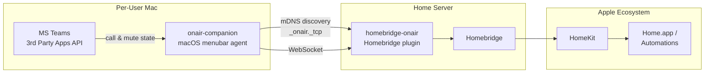
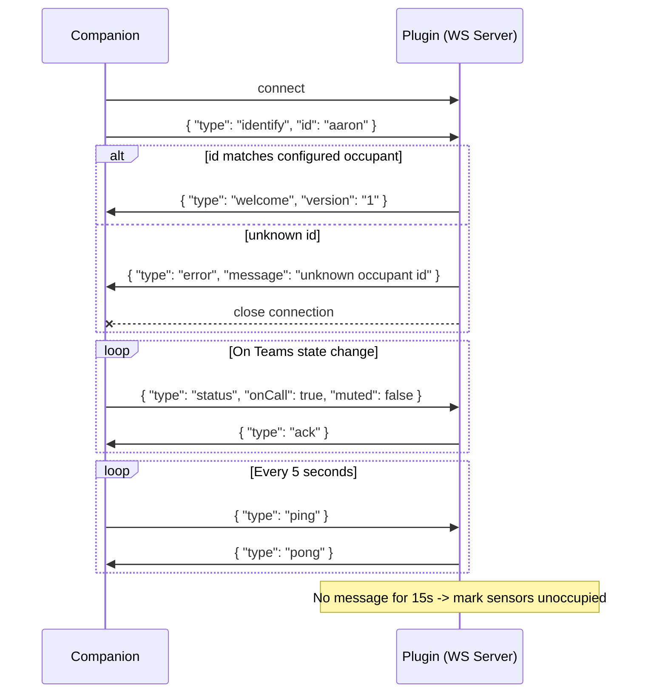

# homebridge-onair

Homebridge plugin that exposes per-occupant HomeKit sensors for Microsoft Teams call and microphone status. Pairs with a companion macOS app that detects Teams state and reports it over WebSocket.

## How It Works

A companion macOS menubar agent (`onair-companion`, separate repo) monitors Microsoft Teams call and mute state on each user's Mac. It discovers the plugin via mDNS and connects over WebSocket to report state changes. The plugin translates those into HomeKit occupancy sensors that can drive automations.



Multiple companion instances (one per user Mac) connect to the single plugin instance.

## Sensor Model

Each configured occupant gets two `OccupancySensor` accessories in HomeKit. The sensors are **additive** — being unmuted on a call means both sensors read as occupied.

| Teams State | On Call Sensor | On Air Sensor |
|-------------|:-:|:-:|
| Not on a call | Not Occupied | Not Occupied |
| On a call, **muted** | Occupied | Not Occupied |
| On a call, **unmuted** | Occupied | Occupied |

### Automation Examples

- **On Air occupied** &rarr; red light ("live mic, do not disturb")
- **On Call occupied** (and On Air not) &rarr; amber light ("in a meeting, muted")
- **Neither occupied** &rarr; light off

## Installation

```bash
npm install -g homebridge-onair
```

Or search for "OnAir" in the Homebridge Config UI X plugin search.

## Configuration

Add the following to your Homebridge `config.json` under the `platforms` array:

```json
{
    "platform": "OnAir",
    "port": 18440,
    "occupants": [
        { "id": "aaron", "displayName": "Aaron" },
        { "id": "sarah", "displayName": "Sarah" }
    ]
}
```

| Field | Type | Default | Description |
|-------|------|---------|-------------|
| `platform` | string | &mdash; | Must be `"OnAir"` |
| `port` | number | `18440` | WebSocket server listen port |
| `occupants` | array | &mdash; | List of occupants to create sensors for |
| `occupants[].id` | string | &mdash; | Stable identifier the companion uses to identify itself |
| `occupants[].displayName` | string | &mdash; | Human-readable name for HomeKit accessories |

Occupants are configured statically. The plugin does not create accessories dynamically from unknown connections, which ensures HomeKit automations referencing these sensors remain stable.

## Protocol Reference

The plugin runs a WebSocket server. All messages are newline-delimited JSON over a single WebSocket connection per companion.



### Client &rarr; Server Messages

| Type | Fields | Description |
|------|--------|-------------|
| `identify` | `id: string` | First message after connect. Must match a configured occupant ID. |
| `status` | `onCall: boolean, muted: boolean` | Teams state update. Sent on every state change. |
| `ping` | &mdash; | Heartbeat. Sent every 5 seconds. |

### Server &rarr; Client Messages

| Type | Fields | Description |
|------|--------|-------------|
| `welcome` | `version: string` | Successful identification. Protocol version for compat checks. |
| `error` | `message: string` | Identification failed or other error. Connection may be closed. |
| `ack` | &mdash; | Status update received and applied. |
| `pong` | &mdash; | Heartbeat response. |

### Duplicate Connection Handling

If a companion connects with an occupant ID that already has an active WebSocket, the **new connection wins** — the old socket is closed. This ensures clean recovery from crashes, network drops, and laptop wake.

### Stale Detection

The plugin resets a per-occupant timer on any received message (status, ping, or identify). If no message is received for 15 seconds (3 missed heartbeats), both sensors are marked as "not occupied."

## mDNS Discovery

The plugin advertises `_onair._tcp` via mDNS so companion apps can discover it automatically.

- **Service type:** `_onair._tcp`
- **Port:** configured WebSocket port
- **TXT record:** `v=1` (protocol version)

The companion browses for `_onair._tcp`, with a fallback to manual URI entry for networks where mDNS is unreliable.

## License

ISC
